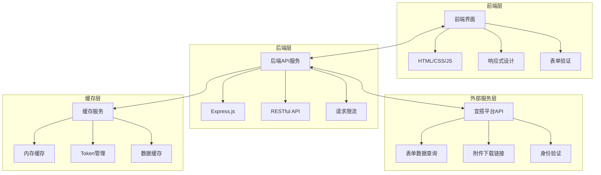
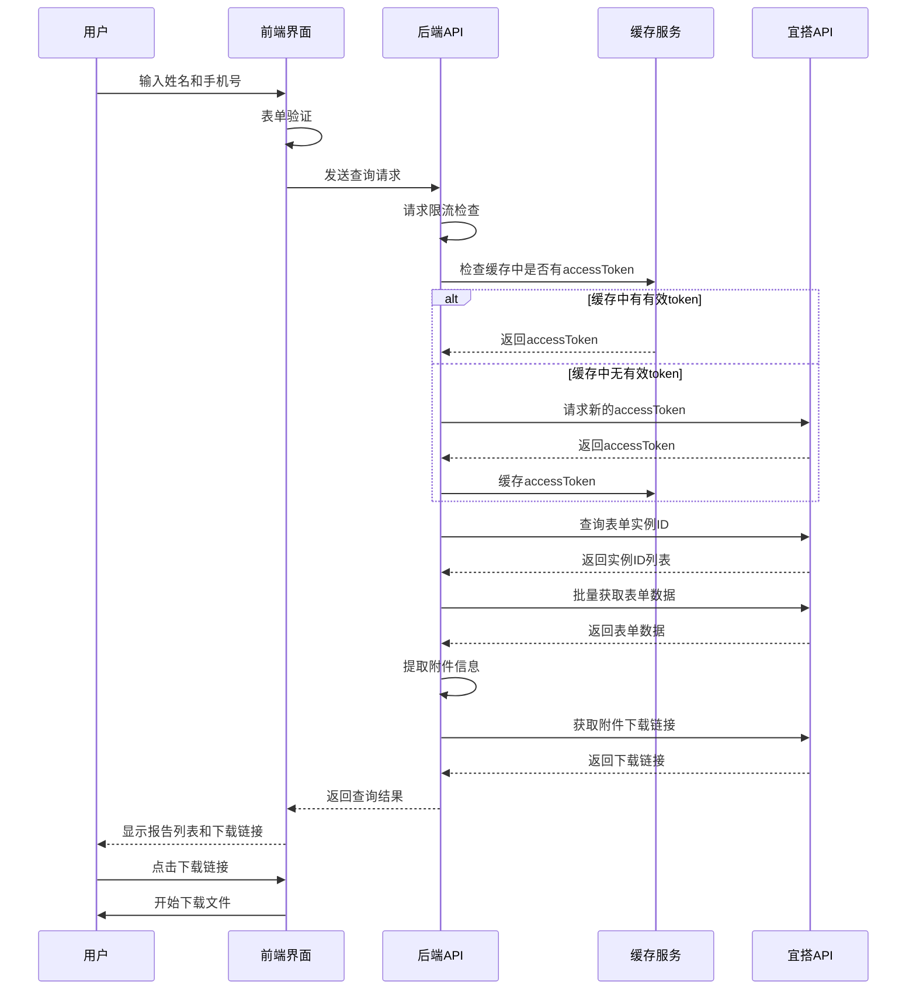

# 报告查询系统 (Report-YiDa)

[](https://opensource.org/licenses/MIT)
[](https://nodejs.org/)
[](https://expressjs.com/)
[](https://www.docker.com/)
[](http://makeapullrequest.com)
[](https://developer.mozilla.org/en-US/docs/Web/JavaScript)
[](https://restfulapi.net/)
[](https://www.dingtalk.com/)
[](https://www.dingtalk.com/qidian/)
[](https://developer.mozilla.org/en-US/docs/Learn/CSS/CSS_layout/Responsive_Design)
[](https://webhooks.dev/)

一个基于宜搭API的报告查询系统，允许外部用户通过姓名和手机号免登录查询并下载报告。

## 📋 目录

- [项目概述](#项目概述)
- [技术架构](#技术架构)
- [环境配置指南](#环境配置指南)
- [开发流程](#开发流程)
- [API接口文档](#api接口文档)
- [代码规范](#代码规范)
- [贡献指南](#贡献指南)
- [常见问题解答](#常见问题解答)
- [许可证](#许可证)

## 🎯 项目概述

报告查询系统是一个基于Node.js和Express构建的Web应用程序，通过与钉钉宜搭平台API集成，为外部用户提供免登录的报告查询和下载功能。系统采用前后端分离架构，前端使用原生HTML/CSS/JavaScript实现响应式设计，后端通过RESTful API提供服务。

### 核心功能

-   **免登录查询**: 外部用户无需登录即可通过姓名和手机号查询报告
-   **安全验证**: 通过姓名和手机号双重验证确保数据安全
-   **灵活配置**: 支持通过环境变量对接不同宜搭实例
-   **响应式设计**: 适配各种设备屏幕尺寸，支持深色模式
-   **主题切换**: 支持手动切换亮色/深色主题，自动跟随系统偏好
-   **缓存优化**: 内置缓存机制减少API调用次数
-   **容器化部署**: 支持Docker和Docker Compose部署
-   **WebHook通知**: 实时查询事件通知，便于系统集成和监控

## 🏗️ 技术架构

### 系统架构图



### 数据流程图



### 技术栈

#### 后端技术
-   **运行环境**: Node.js (>=20.6.0)
-   **Web框架**: Express.js 4.18+
-   **HTTP客户端**: Native Fetch (Node.js内置)
-   **环境变量管理**: Node.js内置 (--env-file)
-   **缓存**: 内存缓存 (Map对象)

#### 前端技术
- **基础**: HTML5, CSS3, JavaScript (ES6+)
- **样式**: 自定义CSS，响应式设计
- **交互**: 原生JavaScript，无框架依赖

#### 部署与运维
- **容器化**: Docker, Docker Compose
- **进程管理**: PM2 (生产环境推荐)
- **日志**: 控制台输出 (可扩展为文件日志)

### 项目结构

```
Report-YiDa/
├── public/                # 前端静态文件
│   ├── index.html         # 主页面
│   ├── styles.css         # 样式文件
│   └── script.js          # 前端脚本
├── services/              # 服务层
│   ├── cacheService.js    # 缓存服务
│   ├── webhookService.js  # WebHook通知服务
│   └── yidaService.js     # 宜搭API服务
├── .env.example           # 环境变量示例
├── .gitignore             # Git忽略文件
├── docker-compose.yml     # Docker Compose配置
├── Dockerfile             # Docker镜像配置
├── package.json           # 项目依赖
└── server.js              # 服务器入口
```

## ⚙️ 环境配置指南

### 系统要求

- Node.js 16.0.0 或更高版本
- npm 或 yarn
- 有效的宜搭应用凭证

### 环境变量配置

创建`.env`文件并配置以下变量：

```bash
# 必需配置
USERID=your_user_id
CLIENT_ID=your_dingtalk_app_key
CLIENT_SECRET=your_dingtalk_app_secret
APP_TYPE=your_yida_app_type
SYSTEM_TOKEN=your_yida_system_token
FORM_UUID=your_form_uuid
NAME_FIELD_ID=your_name_field_id
PHONE_FIELD_ID=your_phone_field_id
ATTACHMENT_FIELD_ID=your_attachment_field_id

# 可选配置
TIMEOUT=86400000
PORT=8080
NODE_ENV=production
WEBHOOK_URL=https://your-webhook-endpoint.com/api/events
```

### 宜搭表单要求

为确保系统正常工作，存放报告附件的表单必须包含以下三个组件：

1. **姓名** - 文本组件，用于存储用户姓名
2. **手机号** - 文本组件，用于存储用户手机号
3. **附件** - 附件组件，用于存储报告文件

## ☁️ 部署指南

### 一键部署到 Vercel

[](https://vercel.com/new/clone?repository-url=https%3A%2F%2Fgithub.com%2FNTLx%2Fsearch.report-yida&env=USERID,CLIENT_ID,CLIENT_SECRET,APP_TYPE,SYSTEM_TOKEN,FORM_UUID,NAME_FIELD_ID,PHONE_FIELD_ID,ATTACHMENT_FIELD_ID)

1. 点击上方按钮开始部署
2. 在 Vercel 控制台中配置必要的环境变量（参考 `.env.example`）
3. 等待部署完成即可访问

### 部署到 GitHub Pages

本项目的 GitHub Pages 部署仅包含前端静态页面。由于 GitHub Pages 不支持运行 Node.js 后端，您需要：

1. **部署后端服务**：先将本项目部署到 Vercel 或其他支持 Node.js 的平台，获取后端 API 地址（例如 `https://your-app.vercel.app`）。
2. **配置前端**：
   - 修改 `public/config.js` 文件
   - 将 `apiBaseUrl` 设置为您的后端服务地址：
     ```javascript
     window.AppConfig = {
         apiBaseUrl: 'https://your-app.vercel.app'
     };
     ```
3. **推送到 GitHub**：
   - 代码推送到 `main` 分支后，GitHub Actions 会自动构建并部署到 GitHub Pages。
   - 或者手动运行 `npm run deploy` 部署。

> **注意**：如果使用 Vercel 部署全栈应用（前后端在一起），则**不需要**修改 `public/config.js`，保持默认空字符串即可。

## 🚀 开发流程

### 本地开发环境搭建

1. 克隆仓库
```bash
git clone https://github.com/NTLx/search.report-yida.git
cd search.report-yida
```

2. 安装依赖
```bash
npm install
```

3. 配置环境变量
```bash
cp .env.example .env
# 编辑 .env 文件，填入您的宜搭应用凭证
```

4. 启动开发服务器
```bash
npm start
```

服务将在 http://localhost:8080 上运行。

### 开发工作流

1. **功能开发**
   - 创建功能分支: `git checkout -b feature/your-feature-name`
   - 实现功能并编写测试
   - 确保代码符合项目规范

2. **代码审查**
   - 提交代码前运行测试: `npm test`
   - 代码检查: `npm run lint`
   - 修复所有检查问题

3. **提交代码**
   - 提交代码: `git commit -m 'feat: add new feature'`
   - 推送到远程: `git push origin feature/your-feature-name`
   - 创建Pull Request

### 调试技巧

1. **日志调试**
   - 使用`console.log()`输出关键信息
   - 检查浏览器开发者工具的Network和Console面板
   - 查看服务器端控制台输出

2. **API调试**
   - 使用Postman或curl测试API端点
   - 检查请求/响应格式和状态码
   - 验证宜搭API返回的数据结构

3. **前端调试**
   - 使用浏览器开发者工具调试JavaScript
   - 检查CSS样式和响应式布局
   - 测试不同设备和浏览器兼容性

## 📚 API接口文档

### 查询报告

**端点**: `POST /api/query-reports`

**请求体**:
```json
{
  "name": "张三",
  "phone": "13800138000",
  "fromDate": "2025-01-01",  // 可选
  "toDate": "2025-12-31",    // 可选
  "pageSize": 100,           // 可选，默认100
  "currentPage": 1           // 可选，默认1
}
```

**响应**:
```json
{
  "success": true,
  "data": [
    {
      "fileName": "体检报告.pdf",
      "downloadUrl": "https://...",
      "createTime": "2025-11-24T10:30:00Z",
      "formInstanceId": "instance_id",
      "error": null
    }
  ],
  "pagination": {
    "currentPage": 1,
    "pageSize": 100,
    "totalCount": 1,
    "totalPages": 1
  },
  "summary": {
    "total": 1,
    "valid": 1,
    "errors": 0
  },
  "message": "找到 1 份报告，当前页显示 1 份，其中 1 份可下载"
}
```

### 健康检查

**端点**: `GET /health`

**响应**:
```json
{
  "status": "ok",
  "timestamp": "2025-11-24T10:30:00.000Z"
}
```

### WebHook事件通知

系统支持WebHook功能，可在查询事件发生时向指定URL发送实时通知。

#### 配置方法

在`.env`文件中设置`WEBHOOK_URL`环境变量：

```env
WEBHOOK_URL=https://your-webhook-endpoint.com/api/events
```

#### 事件类型

系统会发送以下类型的查询事件：

1. **查询开始** (`query_start`)
2. **查询完成** (`query_complete`)
3. **查询失败** (`query_failed`)
4. **无结果** (`query_no_results`)

#### WebHook数据格式

**查询开始事件示例**:
```json
{
  "metadata": {
    "phase": "query_start"
  },
  "system": {
    "environment": "production",
    "source": "Report-YiDa",
    "version": "1.3.0"
  },
  "messageType": "search",
  "resultSummary": {},
  "parameters": {
    "fromDate": "1704067200000",
    "searchType": "nameAndPhone",
    "phone": "13800138000",
    "toDate": "1735689599999",
    "name": "张三",
    "pageSize": 100,
    "currentPage": 1
  },
  "queryId": "query_1704067200000_a1b2c3d4",
  "timestamp": "1704067200000",
  "status": "started"
}
```

**查询完成事件示例**:
```json
{
  "metadata": {
    "phase": "query_complete",
    "processingTime": 1054
  },
  "system": {
    "environment": "production",
    "source": "Report-YiDa",
    "version": "1.3.0"
  },
  "messageType": "search",
  "resultSummary": {
    "resultCount": 4,
    "totalCount": 2,
    "validCount": 4,
    "errorCount": 0,
    "processingTime": 1054
  },
  "parameters": {
    "fromDate": "1704067200000",
    "searchType": "nameAndPhone",
    "phone": "13800138000",
    "toDate": "1735689599999",
    "name": "张三",
    "pageSize": 100,
    "currentPage": 1
  },
  "queryId": "query_1704067200000_a1b2c3d4",
  "timestamp": "1704067201054",
  "status": "success"
}
```

#### 字段说明

| 字段 | 类型 | 说明 |
|------|------|------|
| metadata | object | 元数据，包含事件阶段和处理时间等信息 |
| metadata.phase | string | 事件阶段，如"query_start"、"query_complete"等 |
| metadata.processingTime | number | 处理时间（毫秒），仅在查询完成事件中存在 |
| system | object | 系统信息 |
| system.environment | string | 运行环境，如"production" |
| system.source | string | 系统来源，固定为"Report-YiDa" |
| system.version | string | 系统版本号 |
| messageType | string | 消息类型，固定为"search" |
| resultSummary | object | 查询结果摘要 |
| resultSummary.resultCount | number | 结果数量 |
| resultSummary.totalCount | number | 总数量 |
| resultSummary.validCount | number | 有效结果数量 |
| resultSummary.errorCount | number | 错误数量 |
| resultSummary.processingTime | number | 处理时间（毫秒） |
| parameters | object | 查询参数 |
| parameters.fromDate | string | 开始日期时间戳 |
| parameters.searchType | string | 搜索类型，如"nameAndPhone" |
| parameters.phone | string | 查询的手机号 |
| parameters.toDate | string | 结束日期时间戳 |
| parameters.name | string | 查询的姓名 |
| parameters.pageSize | number | 每页大小 |
| parameters.currentPage | number | 当前页码 |
| queryId | string | 查询的唯一标识符 |
| timestamp | string | 事件发生的时间戳（毫秒） |
| status | string | 查询状态，如"started"、"success"等 |

#### 安全注意事项

- WebHook URL应使用HTTPS协议
- 建议对接收的WebHook请求进行签名验证
- 避免在WebHook URL中包含敏感信息

## 📝 代码规范

### JavaScript代码规范

项目遵循 [Airbnb JavaScript Style Guide](https://github.com/airbnb/javascript) 代码规范，主要规则包括：

1. **命名规范**
   - 使用驼峰命名法 (camelCase)
   - 常量使用大写下划线命名 (UPPER_SNAKE_CASE)
   - 类名使用帕斯卡命名法 (PascalCase)

2. **代码格式**
   - 使用2个空格缩进
   - 字符串优先使用单引号
   - 行末不加分号
   - 函数参数之间使用空格

3. **最佳实践**
   - 优先使用const，其次是let，避免使用var
   - 使用箭头函数代替匿名函数
   - 使用解构赋值简化代码
   - 优先使用async/await处理异步操作

### 文件命名规范

- JavaScript文件使用小驼峰命名法 (e.g., `cacheService.js`)
- CSS文件使用短横线命名法 (e.g., `magic-styles.css`)
- HTML文件使用小写字母和短横线 (e.g., `index.html`)

### 注释规范

1. **文件注释**
   - 每个文件顶部添加文件描述注释
   - 包含文件功能、作者、创建日期等信息

2. **函数注释**
   - 使用JSDoc格式注释函数
   - 包含函数描述、参数说明、返回值说明

3. **代码注释**
   - 复杂逻辑添加行内注释
   - 注释应解释"为什么"而不是"是什么"

### Git提交规范

使用 [Conventional Commits](https://www.conventionalcommits.org/) 规范：

- `feat:` 新功能
- `fix:` 修复bug
- `docs:` 文档更新
- `style:` 代码格式调整
- `refactor:` 代码重构
- `test:` 测试相关
- `chore:` 构建过程或辅助工具的变动

示例：
```
feat: add report download functionality
fix: resolve mobile input field click issue
docs: update API documentation
```

## 🤝 贡献指南

我们欢迎任何形式的贡献！无论是提交问题、功能请求还是直接贡献代码。

### 贡献流程

1. **Fork 本仓库**
   - 访问 https://github.com/NTLx/search.report-yida
   - 点击右上角的"Fork"按钮

2. **创建您的特性分支**
   ```bash
   git checkout -b feature/AmazingFeature
   ```

3. **提交您的更改**
   ```bash
   git commit -m 'Add some AmazingFeature'
   ```

4. **推送到分支**
   ```bash
   git push origin feature/AmazingFeature
   ```

5. **打开一个 Pull Request**
   - 在GitHub上创建Pull Request
   - 填写详细的PR描述
   - 等待代码审查

### 代码审查标准

- 代码符合项目规范
- 包含适当的测试
- 文档已更新（如需要）
- 所有CI检查通过

### 问题报告

使用GitHub Issues报告问题时，请包含：

1. 问题描述
2. 复现步骤
3. 期望行为
4. 实际行为
5. 环境信息（操作系统、Node.js版本等）
6. 相关日志或截图

更多详细信息请参考 [贡献指南](CONTRIBUTING.md)。

## ❓ 常见问题解答

更多常见问题和详细解答请参考 [常见问题文档](FAQ.md)。

### 开发环境问题

**Q: 启动服务时提示端口被占用怎么办？**

A: 可以通过以下方式解决：
1. 修改`.env`文件中的`PORT`变量，使用其他端口
2. 终止占用当前端口的进程：
   ```bash
   # 查找占用端口的进程
   lsof -i :8080
   # 终止进程
   kill -9 <PID>
   ```

**Q: 宜搭API调用失败怎么办？**

A: 检查以下几点：
1. 确认`.env`文件中的凭证信息正确
2. 检查网络连接是否正常
3. 验证宜搭应用权限配置
4. 查看服务器日志获取详细错误信息

### 部署问题

**Q: Docker部署时容器启动失败怎么办？**

A: 排查步骤：
1. 检查Docker镜像是否构建成功
2. 确认环境变量配置正确
3. 查看容器日志：
   ```bash
   docker logs <container_id>
   ```
4. 检查端口映射是否正确

**Q: 如何在生产环境中优化性能？**

A: 优化建议：
1. 使用PM2管理Node.js进程
2. 启用gzip压缩
3. 配置反向代理（如Nginx）
4. 设置适当的缓存策略
5. 监控系统资源使用情况

### 功能问题

**Q: 如何扩展系统支持更多查询条件？**

A: 扩展步骤：
1. 修改前端表单添加新字段
2. 更新后端API处理新参数
3. 修改宜搭API查询逻辑
4. 更新相关文档

**Q: 如何实现用户权限管理？**

A: 实现方案：
1. 添加用户认证中间件
2. 实现基于角色的访问控制
3. 设计权限数据库表结构
4. 更新API添加权限验证

## 📄 许可证

本项目采用 MIT 许可证 - 查看 [LICENSE](LICENSE) 文件了解详情。

## 🙏 致谢

本项目的实现离不开以下优秀的平台和开源项目，我们在此表示诚挚的感谢：

### 平台与服务

- **[钉钉](https://www.dingtalk.com/)** - 提供了强大的企业级通信和协作平台
- **[宜搭](https://www.dingtalk.com/qidian/)** - 提供了灵活的低代码应用开发平台，使表单数据管理和查询变得简单高效

### 开源项目

- **[Node.js](https://nodejs.org/)** - 高性能的JavaScript运行时环境
- **[Express.js](https://expressjs.com/)** - 简洁、灵活的Node.js Web应用框架

### 工具与资源

- **[Docker](https://www.docker.com/)** - 开放平台，用于开发、交付和运行应用程序
- **[Mermaid](https://mermaid-js.github.io/)** - 用于创建流程图和图表的标记语言
- **[GitHub](https://github.com/)** - 提供代码托管和版本控制服务
- **[Shields.io](https://shields.io/)** - 提供美观的徽章生成服务

### 社区贡献者

感谢所有为这个项目贡献代码、提出建议和反馈问题的社区成员。您的参与使这个项目变得更好！

---

**免责声明**: 本项目仅用于学习和研究目的。请确保您有权限访问和使用宜搭API，并遵守相关法律法规和平台使用条款。